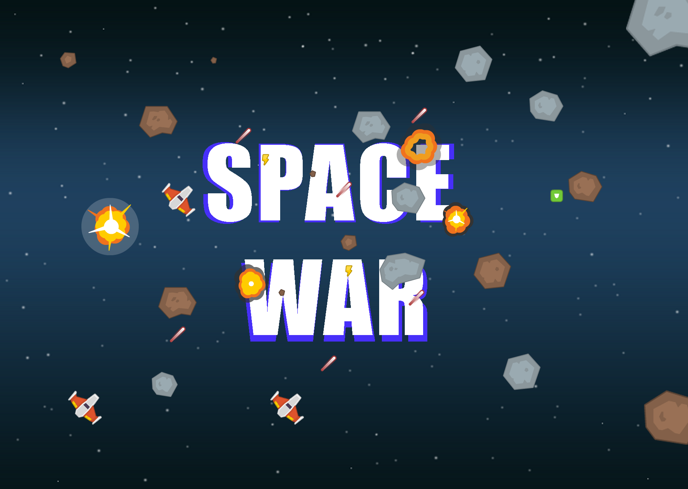

# SPACE WAR 🚀

"SPACE WAR is my modern reimagining of the classic shoot 'em up (shmup) genre, built with Pygame. Featuring enhanced graphics and immersive sound effects, it delivers an adrenaline-pumping, keyboard-busting experience. This game pays homage to the genre's origins, inspired by Spacewar!—one of the earliest computer games, created in 1962."

## Gameplay


* Shoot the incoming meteros to score points.
* Item drops will give you random powerups or penalties.

## Setup

Clone the github repository:
```
git clone https://github.com/saleeqmohammed/space_war_game.git
```
You can also download as zip from [here.](https://github.com/saleeqmohammed/space_war_game.git)


Run the executable for windows or linux bu couble clicking or:
```
cd ./space_war_game
./space_war.exe
```
In case of security issues, build and play by running:

```
cd ./space_war_game
python3 -m space_war.py
```
You might need to give permission to install pygame.

Enjoy 🚀😊 !